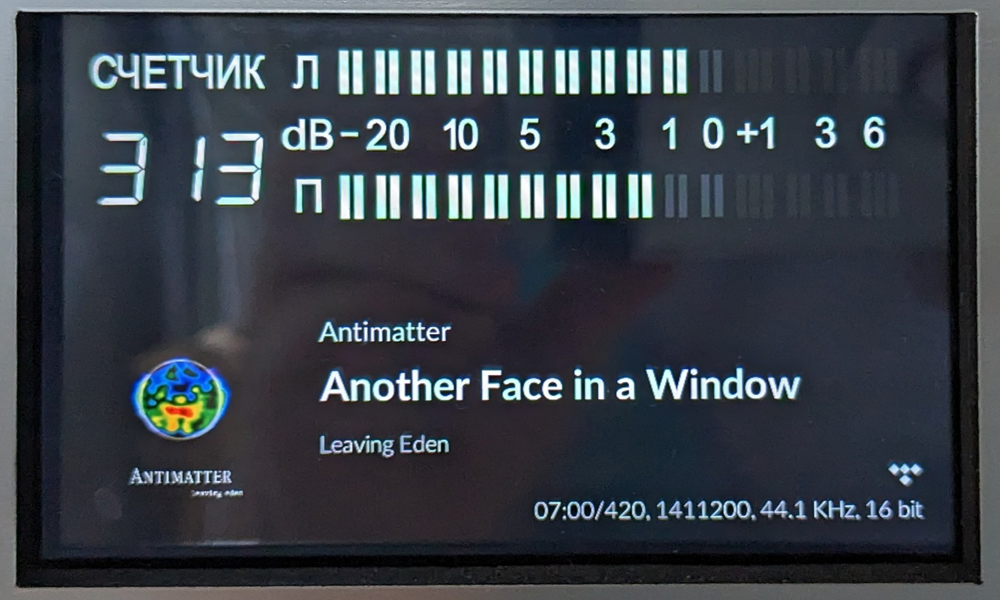

# PHTS NP-01: VU meter

This is a modification of [PeppyMeter] plugin which is used by [PHTS NP-01].

Currently not used as a standalone plugin due to compatibility issues with `FusionDsp` and `Spotify` plugins. Used as an internal repo fetched by [my fork of `Peppy-meter-Basic` plugin](https://github.com/phts/NP-01_plugins/tree/master/peppymeterbasic).

Tweaks made to [the original repo][PeppyMeter]:

- Add time type "counter"
- New meters (like on [Radiotehnika HiFi components][radiotehnika])
- More realistic linear meter dynamics [[48a5ef7](https://github.com/phts/NP-01_vu-meter/commit/48a5ef7875ec6d82e621b7e395d40f120651bfad)]
- Option `volume.max.use.real` to use real software volume level as max meter level
- Render bitrate, year, track number
- [...and more][commits]

[peppymeter]: https://github.com/project-owner/PeppyMeter
[phts np-01]: https://tsaryk.com/NP-01
[commits]: https://github.com/phts/NP-01_vu-meter/commits/master
[radiotehnika]: https://ldsound.info/radiotexnika-mp-7301-stereo/
